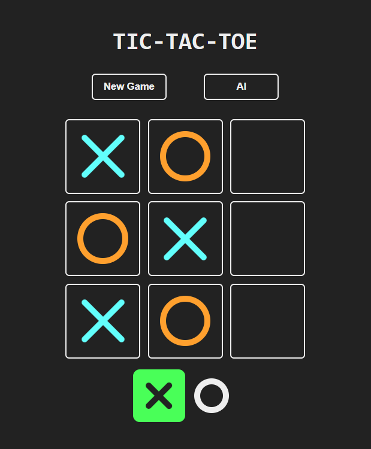

<h1 align="center">TIC-TAC-TOE-GAME</h1>

## :rocket: Knowledges

- `ReactJS`
- `Framer Motion`

## :link: Demo

- <a target="_blank" href="https://shl-tic-tac-toe.netlify.app/"> Click Here </a> to see and play by yourself a demo of the game.



Tic Tac Toe is a classic two-player game played on a 3x3 grid. The goal is to be the first player to place three of their marks (traditionally X or O) in a horizontal, vertical, or diagonal row.

The Minimax algorithm is commonly used in Tic Tac Toe to create an AI opponent. It's a decision-making algorithm used in game theory to find the optimal move for a player, assuming that the opponent is also playing optimally. The algorithm works by recursively evaluating the possible outcomes of each move and choosing the one that maximizes the player's chances of winning or minimizes the opponent's chances.

Here's how the Minimax algorithm can be applied to Tic Tac Toe:

Evaluation Function: Define an evaluation function that assigns a score to each possible game state. In Tic Tac Toe, a simple evaluation function can assign a positive score if the player is winning, a negative score if the opponent is winning, and zero for a draw.

Recursive Search: Implement a recursive search function that explores all possible moves from the current game state. For each possible move, evaluate the resulting game state using the evaluation function. If the game hasn't ended, recursively search further until a terminal state (win, loss, or draw) is reached.

Minimax Decision: At each level of the search tree, alternate between maximizing and minimizing player scores. For the maximizing player (e.g., X), choose the move with the highest score, assuming the opponent will make the best possible move to minimize the score. For the minimizing player (e.g., O), choose the move with the lowest score, assuming the opponent will make the best possible move to maximize the score.

Alpha-Beta Pruning: To improve performance, implement alpha-beta pruning, which prunes branches of the search tree that are guaranteed to be worse than previously explored branches. This optimization reduces the number of nodes evaluated during the search.

Move Selection: Once the search reaches the root level, select the move with the highest score for the maximizing player and the lowest score for the minimizing player. This move represents the optimal move according to the Minimax algorithm.

## :book: How to use

To clone and run this application, you'll need [Git](https://git-scm.com/downloads) and [ReactJS](https://react.dev/) installed on your computer. From your command line:

```
# Clone this repository
$ git clone

# Go into the repository
$ cd TIC-TAC-TOE-GAME

# Install dependencies
$ npm install

# Run the app
$ npm start
```

## :mailbox: Contact

- <a target="_blank" href="www.linkedin.com/in/shashank-hl">LinkedIn</a>
